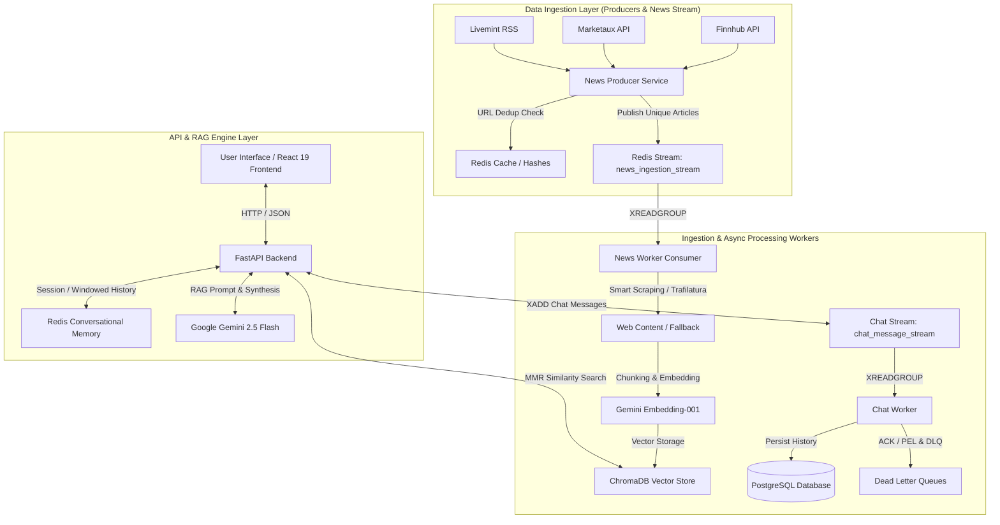

# QueryNexus ⚡

**QueryNexus** is an advanced streaming **Retrieval-Augmented Generation (RAG)** platform designed to filter global noise and deliver high-precision intelligence. Unlike standard chatbots that hallucinate, QueryNexus acts as a deterministic **News Intelligence Engine**, aggregating real-time data from trusted financial, technological, and market sources to answer complex queries with cited facts.

---

## 🏗️ System Architecture

The application is designed for high throughput asynchronous data processing, sub-second vector search, and fault-tolerant message handling.

### 📐 Architecture Diagram



---

### 1. Data Ingestion Layer (The Pipeline) 🌊
*   **Producers**: Standalone background services fetching real-time headlines from external financial APIs (Finnhub, Marketaux, Livemint) every 15 minutes.
*   **Message Stream (Redis Streams)**: Decouples ingestion from downstream processing via `news_ingestion_stream`. Uses consumer groups (`news_workers`), Pending Entries List (PEL) tracking, and startup recovery via `XAUTOCLAIM`.
*   **Ingestion Workers**: Background workers consume stream entries, perform **Smart Scraping** (Trafilatura) for full article content, generate embeddings via Google Gemini Embedding-001, and index chunks into ChromaDB.

### 2. Intelligence Layer (The Brain) 🧠
*   **Vector Database (ChromaDB)**: Stores semantic embeddings of news articles for similarity search.
*   **RAG Engine**: Upon receiving user queries, the engine rewrites queries (Gemini Flash Lite), performs Maximal Marginal Relevance (MMR) search across article embeddings, and feeds verified context to **Gemini 2.5 Flash**.
*   **Lifecycle Management**: Dead Letter Queues (`news_ingestion_dlq` & `chat_message_dlq`) handle poison-pill entries and retry limits safely.

### 3. Application Layer (The Interface) 💻
*   **Backend (FastAPI)**: High-performance Async I/O server handling user authentication, session management, and RAG pipelines.
*   **State & Caching (Redis Stack)**: Manages real-time message streams (`chat_message_stream`), rolling sliding-window conversational memory, URL deduplication hashes, and rate limiting.
*   **Frontend (React 19)**: Responsive UI built with Vite, Redux Toolkit, and TailwindCSS for interactive chat streaming and source verification.

---

## 🚀 Key Features

### 🧠 AI & RAG
*   **Zero-Hallucination Policy**: Strict context grounding refusing answers if relevant articles are missing.
*   **Source Citation**: Every response includes clickable references to original news articles.
*   **Smart Context**: MMR retrieval with similarity filtering to eliminate redundancy.

### 🛡️ Security & Performance
*   **Rate Limiting**: Token Bucket algorithm via Redis to prevent API abuse.
*   **HttpOnly Auth**: Secure JWT session handling with HttpOnly cookies.
*   **Middleware**: Robust CORS configuration and trusted host validation.

### ⚡ Data Engineering & Background Processing
*   **Redis Streams Queuing**: Built-in ACK-based message delivery (`XREADGROUP`, `XACK`), crash safety with Pending Entries List (PEL), and Dead Letter Queues (DLQ).
*   **URL Deduplication**: MD5 hash-based Redis caching (3-day TTL) ensuring zero duplicate processing.

---

## 🛠️ Tech Stack

<div align="center">
  
  
  
  
  
  
  
  
  
</div>
<br/>

### Backend
*   **Language**: Python 3.10+ 🐍
*   **Framework**: FastAPI (Async) ⚡
*   **Validation**: Pydantic 🔍
*   **ORM**: SQLAlchemy 🗄️

### Data & Infrastructure
*   **Message Queuing**: Redis Streams (Consumer Groups, PEL, DLQ) 🔴
*   **Vector DB**: ChromaDB 🌲
*   **Primary DB**: PostgreSQL 🐘
*   **Caching & Memory**: Redis (Session management, Conversational Windowing, Rate Limiting) 🔴
*   **Containerization**: Docker & Docker Compose 🐳

### Frontend
*   **Framework**: React 19 (Vite) ⚛️
*   **State Management**: Redux Toolkit 🔄
*   **Styling**: TailwindCSS 🎨
*   **Networking**: Axios 🌐

---

## 📂 Project Structure

```bash
QueryNexus/
├── Backend/
│   ├── app/
│   │   ├── AI_Engine/      # RAG Logic, Prompting, Retriever, Vector DB Ingestion
│   │   ├── APIs/           # External News APIs & Web Scraping Services
│   │   ├── Controllers/    # Business & Chat Logic
│   │   ├── Models/         # Database Schemas (SQLAlchemy)
│   │   ├── Redis/          # Redis Streams Services, Producers & Background Workers
│   │   │   ├── redis_client.py    # Redis Client Singleton Connection Pool
│   │   │   ├── redis_service.py   # Streams, Consumer Groups, PEL & DLQ Operations
│   │   │   ├── redis_worker.py    # Chat Message Persistence Worker
│   │   │   ├── news_producer.py   # News Ingestion Stream Producer
│   │   │   └── news_worker.py     # News Content Processing & Embedding Worker
│   │   ├── Routes/         # API Endpoints
│   │   └── main.py         # App Entry Point
│   ├── Dockerfile
│   └── docker-compose.yml
└── Frontend/
    ├── src/
    │   ├── App/            # Store Configuration
    │   ├── Features/       # Redux Slices (Auth, Chat)
    │   ├── components/     # UI Components (Dashboard, Sidebar)
    │   └── pages/          # Page Views
    └── index.html
```

---

## ⚙️ Setup & Installation

### Prerequisites
*   Docker & Docker Compose
*   Python 3.10+
*   Node.js 18+

### 1. Infrastructure (Docker)
Start the core services (PostgreSQL, Redis Stack):
```bash
cd Backend
docker-compose up -d
```

### 2. Backend Setup
```bash
cd Backend
python -m venv venv
source venv/bin/activate  # or venv\Scripts\activate on Windows
pip install -r requirements.txt

# Run the API Server
uvicorn app.main:app --reload
```

### 3. Background Workers (Redis Streams)
Run the background producers and stream consumers in separate terminal windows:
```bash
cd Backend

# 1. Start Chat Message Database Persistence Worker
python -m app.Redis.redis_worker

# 2. Start News Ingestion Producer
python -m app.Redis.news_producer

# 3. Start News Ingestion & Embedding Worker
python -m app.Redis.news_worker
```

### 4. Frontend Setup
```bash
cd Frontend
npm install
npm run dev
```

---

*QueryNexus - Beyond the Headlines. Behind the Trends.*